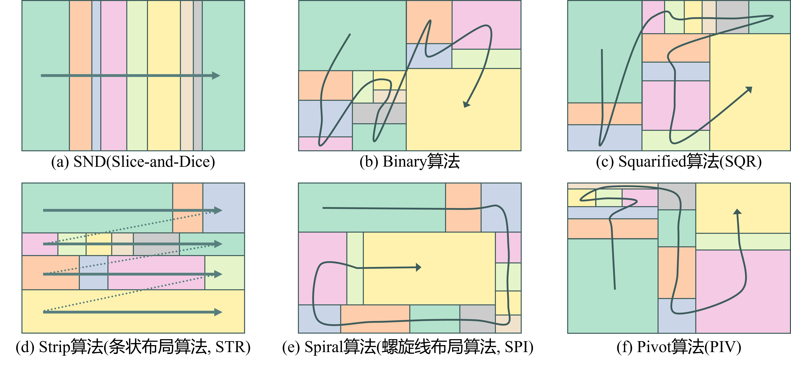
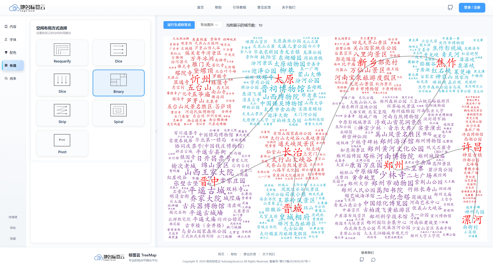

# TreeMap 标签云可视化系统 - 用户手册

## 概述

最后更新时间：2025年11月28日

### 1. 项目定位

`tagCloud_treemap` 是一个面向 **空间路径语义分析** 与 **地理信息可视化** 的专业级可视化系统。系统深度融合高德地图 API、POI（Point of Interest）数据挖掘与多算法 TreeMap 布局引擎，构建了从 **路径绘制 → 空间数据筛选 → 权重映射 → 标签云生成** 的完整数据可视化工作流。系统特别强化了 **矩形树图（Treemap）剖分算法**、**空间拓扑关联分析** 与 **实时参数联动渲染** 等核心能力，可应用于旅游线路规划、交通走廊流量分析、地理教学演示、区域热点识别等场景。

### 2. 核心特性

#### 2.1 空间路径感知与数据关联

- **智能路径识别**：基于高德地图 JSAPI 2.0 支持手绘折线、起止点导航规划等多种路径定义方式
- **空间拓扑匹配**：利用 `@turf/turf` 空间分析库与 GeoJSON 行政区边界数据，自动识别路径穿越的城市级行政区划
- **POI 数据筛选**：基于空间拓扑关系从大规模 POI 数据集中精准筛选途经城市的兴趣点，支持按全国排名进行城市级权重计算

#### 2.2 多算法 TreeMap 布局引擎

系统内置 **7 种经典 TreeMap 布局算法**，每种算法针对不同的数据分布特征和视觉呈现需求：

- **Resquarify**：基于 Squarified 算法的改进版本，优化矩形长宽比，适合展示层次化数据
- **Binary**：二分递归布局，适合快速渲染大规模数据集
- **Dice**：水平切分布局，强调数据的横向分布特征
- **Slice**：垂直切分布局，突出数据的纵向层次关系
- **Strip**：条带式布局，通过动态条带优化空间利用率
- **Spiral**：螺旋式布局，提供独特的视觉呈现效果
- **Pivot**：轴心式布局，适合展示具有中心-边缘结构的数据

所有算法均基于 D3.js 的 `d3-hierarchy` 模块实现，支持实时切换与参数调优。

#### 2.3 实时可视化参数联动

系统采用 **Vue 3 Composition API + Pinia 状态管理** 架构，实现多面板参数的实时同步与标签云画布的即时渲染：

- **内容面板**：城市路线同步、POI 数据筛选
- **字体面板**：字体族选择（中英文字体）、字重调节（100-900）、字号范围设置、字体修改
- **配色面板**：背景色与文字色自定义、四色带调色板、色带翻转、自定义颜色编辑
- **布局面板**：TreeMap 布局算法选择
- **线条面板**：路径连线样式（无/曲线/折线）、线宽与颜色设置

所有参数修改均通过 Pinia Store 统一管理，确保多组件间的数据一致性。

#### 2.4 多格式导出与分享

- **矢量图导出**：支持 SVG 格式导出，保证无损缩放与后期编辑能力
- **位图导出**：支持 PNG、JPEG 格式，可自定义分辨率、锁定宽高比
- **画布复制**：支持将标签云画布内容复制为图片，便于快速嵌入 PPT、论文、海报等场景

#### 2.5 高级可视化特性

- **动态标签遮罩**：支持标签重叠检测与智能避让
- **路径叠加渲染**：在标签云画布上叠加显示原始路径，增强空间关联性
- **邻接着色算法**：基于城市邻接关系自动生成配色方案，确保相邻城市颜色不同，以提升地理语义表达

---

## 快速上手

最后更新时间：2025年11月28日

系统采用 **五步工作流** 实现从路径定义到标签云生成的全流程操作：

### 1. **系统首页与界面导航**
   
   系统采用响应式布局设计，顶部导航栏提供功能入口，左侧边栏为参数配置面板，中央为地图工作区，右侧为标签云画布预览区。首次使用可通过 Intro.js 引导快速了解界面布局。

   

### 2. **路径绘制与空间数据提取**
   
   在地图工作区可通过以下方式定义路径：
   - **手绘折线**：点击地图工具栏的手绘工具，在地图上自由绘制路径
   - **起止点导航**：右键地图设置起点和终点，系统自动调用高德地图驾车导航 API 规划最优路径
   
   路径绘制完成后，系统自动执行以下处理：
   - 路径抽稀与坐标转换
   - 基于 GeoJSON 行政区边界进行空间拓扑匹配
   - 识别路径穿越的城市级行政区划
   - 从 POI 数据集中筛选对应城市的兴趣点

   

### 3. **标签云生成与实时预览**
   
   点击右侧标签云面板的 **"运行生成标签云"** 按钮，系统将：
   - 根据当前选定的 TreeMap 布局算法计算标签位置
   - 基于字号范围限制结合 POI 标签权重映射字号大小
   - 应用当前配色方案进行渲染
   - 在画布上实时显示生成结果
   
   生成过程中显示 Loading 遮罩，完成后自动隐藏。

   

### 4. **可视化参数调优**
   
   在左侧参数配置面板中，可实时调整以下参数，所有修改将立即反映到标签云画布：
   - **字体参数**：字体族、字重、字号范围
   - **配色方案**：背景色、文字色、色带配置
   - **布局算法**：7 种 TreeMap 算法实时切换
   - **路径样式**：连线类型、线宽、颜色
   
   系统采用响应式设计，参数修改后标签云自动重新渲染，无需手动刷新。

   

### 5. **成果导出与分享**
   
   标签云生成完成后，可通过以下方式导出：
   - **SVG 导出**：矢量格式，适合论文、报告等需要高质量印刷的场景
   - **PNG/JPEG 导出**：位图格式，可自定义分辨率，适合网页展示、PPT 演示等场景
   
   对于位图导出，可在对话框中设置图片尺寸、锁定宽高比等参数。

   

---

## 入门教程

最后更新时间：2025年11月28日

### 一、功能面板详解

#### 1. 线路绘制与地图交互

地图工作区基于 **高德地图 JSAPI 2.0** 构建，提供丰富的地图交互能力：

- **地图图层切换**：
  - **热力图层**：在小比例尺地图下，根据 POI 密度生成热力图，适合展示区域热点分布
  - **点状图层**：在大比例尺地图下，以 MassMarks 方式展示 POI 位置，适合精确查看点位信息
  - **底图切换**：支持标准地图、卫星图、路网图等多种底图风格

- **路径绘制模式**：
  - **手绘折线**：通过地图工具栏激活手绘模式，在地图上自由绘制路径，支持多点连续绘制
  - **起止点导航**：右键地图设置起点和终点，系统调用高德地图 Driving 插件自动规划最优路径

- **空间数据提取**：
  - 系统对绘制路径进行 **Douglas-Peucker 算法抽稀**，减少冗余节点
  - 基于 `@turf/turf` 的 `booleanPointInPolygon` 和 `lineIntersect` 方法进行空间拓扑匹配
  - 自动识别路径穿越的城市级行政区划（基于 `public/data/shi.js` 中国市级行政区划 GeoJSON 数据）
  - 从 `public/data/chinapoi.csv` 中筛选对应城市的 POI 数据

- **城市路线同步**：
  - 实时显示路径穿越的城市列表，按路径顺序排列
  - 使用 D3 力导向图渲染展示其顺序

#### 2. 词云绘制

系统支持在城市标签云中嵌入城市名称标签，增强地理语义表达：

- **城市标签激活**：
  - 在内容面板中可选择是否显示城市名称标签
  - 城市标签采用加粗字体，自动居中显示，颜色默认为红色
  - 城市标签与 POI 标签混排，形成层次化的视觉结构

- **标签布局优化**：
  - 系统自动处理城市标签与 POI 标签的重叠问题
  - 支持标签动态避让，确保所有标签清晰可见

#### 3. 字体面板（TypefacePanel）

字体面板提供标签文字的视觉样式配置：

- **字体族选择**：
  - **中文字体**：支持系统字体及 Web 字体，推荐使用等线、微软雅黑等无衬线字体
  - **英文字体**：支持 Arial、Helvetica、Times New Roman 等常用字体
  - 字体选择影响标签云的整体视觉风格，具体根据使用场景选择

- **字重调节**：
  - 支持 100-900 的字重范围（100 最细，900 最粗）
  - 字重影响标签的视觉突出程度，建议根据数据重要性设置

- **字号范围设置**：
  - 可设置最小字号和最大字号（建议范围：16-45 像素）
  - 系统根据权重数据在字号范围内线性映射，实现标签分级

- **标签分级映射**：
  - 支持按城市排名、全国排名等字段自动映射字号
  - 权重越大，字号越大，实现视觉层次化表达

#### 4. 配色面板（ColorPanel）

配色面板提供标签云的色彩方案配置：

- **背景色设置**：
  - 支持自定义画布背景色，推荐使用浅色背景以突出标签文字
  - 背景色影响整体视觉风格，可与具体使用场景协调

- **文字配色方案**：
  - **四色带调色板**：提供预设的四色渐变方案，适合展示数据层次
  - **色带翻转**：支持色带方向反转，快速切换配色风格
  - **自定义颜色**：点击色带任意位置可编辑颜色

- **配色建议**：
  - 学术论文：推荐使用灰度或低饱和度配色
  - 演示汇报：推荐使用高对比度、鲜艳配色

#### 5. TreeMap 布局面板

布局面板提供 **7 种 TreeMap 布局算法** 的实时切换与参数配置：

- **算法选择**：
  - **Resquarify**：基于 Squarified 算法，优化矩形长宽比，适合层次化数据展示
  - **Binary**：二分递归布局，计算效率高，适合大规模数据集
  - **Dice**：水平切分布局，强调数据的横向分布特征
  - **Slice**：垂直切分布局，突出数据的纵向层次关系
  - **Strip**：条带式布局，通过动态条带优化空间利用率
  - **Spiral**：螺旋式布局，提供独特的视觉呈现效果
  - **Pivot**：轴心式布局，适合展示具有中心-边缘结构的数据

- **算法原理**：
  - 所有算法均基于 D3.js 的 `d3-hierarchy` 模块实现
  - 采用递归分割策略，将矩形区域按权重比例分配给子节点
  - 算法切换后，标签云画布立即重新渲染

- **算法选择建议**：
  - 数据层次清晰：推荐 Resquarify、Slice
  - 数据量大：推荐 Binary、Dice
  - 追求视觉效果：推荐 Spiral、Pivot
  - 空间利用率优先：推荐 Strip

算法原理可参考 [d3-hierarchy 官方文档](https://github.com/d3/d3-hierarchy)。

#### 6. 线条与路径样式（LinePanel）

线条面板控制标签云画布上路径连线的视觉样式：

- **连线类型**：
  - **无连线**：不显示路径，仅展示标签云
  - **曲线连线**：使用贝塞尔曲线连接城市标签，强调路径的流畅性
  - **折线连线**：使用直线段连接城市标签，突出路径的节点结构

- **线宽与颜色**：
  - 支持自定义线宽（建议范围：1-5 像素，在能够对标签云的顺序关系产生引导作用的前提下避免喧宾夺主）
  - 支持自定义线条颜色，建议灰色

- **路径叠加渲染**：
  - 在标签云画布上叠加显示原始路径，增强空间关联性
  - 路径样式可独立配置，不影响标签云的视觉呈现

#### 7. 标签云画布与导出（TagCloudCanvas）

标签云画布是系统的核心输出区域，提供实时预览与多格式导出功能：

- **画布渲染**：
  - 基于 D3.js 和 SVG 技术实现矢量图形渲染
  - 渲染过程显示 Loading 遮罩，提升用户体验

- **导出功能**：
  - **SVG 导出**：矢量格式，支持无损缩放，适合论文、报告等高质量印刷场景
  - **PNG/JPEG 导出**：位图格式，可自定义分辨率，适合 PPT 展示

- **导出参数配置**：
  - 支持自定义导出图片的宽度和高度
  - 支持锁定宽高比，保持标签云比例不变形

### 二、常见问题与故障排除

#### 1. 城市识别问题

**问题描述**：路径绘制后，系统未能正确识别途经城市。

**可能原因与解决方案**：
- **路径节点稀疏**：路径节点过少可能导致空间拓扑匹配失败
  - **解决方案**：使用起止点导航功能自动生成密集路径
- **路径未穿越城市**：路径可能完全位于城市边界外
  - **解决方案**：手动修正路线，系统支持手动编辑地图路线

#### 2. 导出图片质量问题

**问题描述**：导出的图片模糊或分辨率不足。

**可能原因与解决方案**：
- **导出格式选择**：
  - **SVG 格式**：矢量格式，支持无损缩放，适合高质量印刷场景
  - **PNG 格式**：位图格式，建议导出时设置较高分辨率（至少 1920×1080 像素）
  - **JPEG 格式**：压缩格式，文件体积小但可能有质量损失，适合快速分享

- **分辨率设置**：
  - 导出前在对话框中设置合适的宽度和高度
  - 建议分辨率：论文插图 1200×800 像素，演示 PPT 1920×1080 像素，大屏展示 3840×2160 像素

### 三、应用案例与最佳实践

#### 案例1：景区旅游路线分析与可视化

**应用场景**：旅游规划、线路讲解、景点推荐

**操作流程**：
1. 在地图上绘制或规划旅游路线（如：北京 → 西安 → 成都 → 昆明）
2. 系统自动识别途经城市并筛选热门景点 POI
3. 根据景点热度（城市排名）设置权重，实现字号分级
4. 选择适合的 TreeMap 布局算法（推荐 Resquarify）
5. 调整配色方案，使用暖色调突出旅游主题
6. 导出高清图片用于旅游宣传材料或讲解演示

#### 案例2：交通走廊流量分析与可视化

**应用场景**：交通规划、流量分析、区域发展研究

**操作流程**：
1. 导入多条交通路径数据（如：高铁线路、高速公路、航空航线）
2. 系统自动识别途经城市并计算交通节点权重
3. 根据交通流量数据设置权重，实现流量可视化
4. 选择 Dice 或 Strip 布局算法，突出横纵向交通走廊特征
5. 使用渐变色带表达流量差异，高流量区域使用深色
6. 叠加路径连线，增强空间关联性表达

#### 案例3：行业热点分析与区域覆盖研究

**应用场景**：商业分析、市场研究、区域规划

**操作流程**：
1. 导入自定义行业数据集（如：连锁门店、展会分布、产业园区）
2. 根据业务指标（如：门店数量、销售额、覆盖范围）设置权重
3. 选择 Binary 或 Pivot 布局算法，适合展示大规模数据
4. 使用行业标准配色方案，增强专业感
5. 分析区域热点与覆盖空白，为业务决策提供数据支持

#### 案例四：地理教学演示与可视化

**应用场景**：地理教学、空间分析教学、数据可视化教学

**操作流程**：
1. 选择典型的地理路径案例（如：丝绸之路、长江经济带、一带一路）
2. 系统自动识别途经城市并展示相关地理信息
3. 使用 Slice 或 Resquarify 布局算法，突出层次结构
4. 采用学术风格的配色方案（低饱和度、高对比度）
5. 导出 SVG 格式用于课件制作，支持无损缩放

---

## 技术文档与参考资料

最后更新时间：2025年11月28日

### 1. 官方文档

- [概述/快速上手/入门教程（PDF 合集）](/doc/地名标签云-概述.pdf)

### 2. 技术参考

- **D3.js 官方文档**：[https://d3js.org/](https://d3js.org/)
- **d3-hierarchy 模块文档**：[https://github.com/d3/d3-hierarchy](https://github.com/d3/d3-hierarchy)
- **d3-cloud 词云库**：[https://github.com/jasondavies/d3-cloud](https://github.com/jasondavies/d3-cloud)
- **Turf.js 空间分析库**：[https://turfjs.org/](https://turfjs.org/)
- **高德地图 JSAPI 文档**：[https://lbs.amap.com/api/javascript-api/summary](https://lbs.amap.com/api/javascript-api/summary)
- **Vue 3 官方文档**：[https://cn.vuejs.org/](https://cn.vuejs.org/)
- **Pinia 状态管理文档**：[https://pinia.vuejs.org/zh/](https://pinia.vuejs.org/zh/)

### 3. 学术论文与理论参考

- **TreeMap 布局算法**：
  - [TreeMap (Johnson B et al., 1991)](https://ieeexplore.ieee.org/document/175815)
  - [SND TreeMap (Shneiderman,Ben, 1992)](https://dl.acm.org/doi/10.1145/102377.115768)
  - [Squarified TreeMap（Bruls et al., 2000）](https://vanwijk.win.tue.nl/stm.pdf)
  - [Strip TreeMap (Bederson B B , Shneiderman B , Wattenberg M, 2002)](https://dl.acm.org/doi/10.1145/571647.571649)
  - [Spirial TreeMap (Tu Y , Shen H W, 2007)](https://ieeexplore.ieee.org/document/4376152)
  - [Pivot TreeMap (Shneiderman B , Wattenberg M, 2002)](https://ieeexplore.ieee.org/document/963283?denied=)
- **中心型标签云**：
  - [以用户地理位置为中心的兴趣点标签云 (成晓强 et al.,2024)](https://d.wanfangdata.com.cn/periodical/dqxxkx202401009)
  - [Lbs tag cloud: a centralized tag cloud for visualization of points of interest in location-based services (Cheng Xiaoqiang et al.,2023)](https://www.mdpi.com/2220-9964/12/9/360)
- **耦合地名标签与TreeMap剖分的可视化方法 、装置及电子设备**

---

## 视频教程专区

最后更新时间：2025年11月28日

### 1. 基础教程

- **系统概述与快速上手**（筹备中）
  - 系统功能介绍
  - 界面布局说明
  - 快速生成第一个标签云

- **路径绘制与数据提取**（筹备中）
  - 手绘折线操作
  - 起止点导航设置
  - 城市识别与 POI 筛选

### 2. 进阶教程

- **TreeMap 布局算法详解**（筹备中）
  - 7 种布局算法原理与适用场景
  - 算法选择策略
  - 布局参数调优技巧

- **可视化参数调优实战**（筹备中）
  - 字体分级与权重映射
  - 配色方案设计
  - 路径样式配置

### 3. 应用案例

- **旅游路线分析案例**（筹备中）
- **交通走廊流量分析案例**（筹备中）
- **行业热点分析案例**（筹备中）

*更多演示视频，后续持续更新*

---

## 技术支持与社区

最后更新时间：2025年11月28日

### 1. 项目资源

- **GitHub 仓库**：[https://github.com/1937983507/tagCloud_treemap2](https://github.com/1937983507/tagCloud_treemap2)
- **在线演示**：[https://www.hubutagcloud.cn/treemap](https://www.hubutagcloud.cn/treemap)
- **项目主页**：访问项目 GitHub 主页获取最新版本、更新日志和开发文档

### 2. 问题反馈与技术支持

- **问题反馈**：
  - 在 GitHub 仓库提交 Issue，详细描述问题现象、复现步骤和预期行为
  - 发送邮件至 1937983507@qq.com，主题注明 "tagCloud_treemap2 问题反馈"

- **功能建议**：
  - 在 GitHub 仓库提交 Feature Request，描述功能需求和使用场景
  - 发送邮件至 1937983507@qq.com，主题注明 "tagCloud_treemap2 功能建议"

- **技术支持**：
  - 如需行业定制、技术咨询或深度技术支持，欢迎联系 1937983507@qq.com
  - 我们将在 3-5 个工作日内回复您的咨询

### 3. 贡献与参与

我们欢迎社区贡献，包括但不限于：
- **代码贡献**：提交 Pull Request，改进功能或修复 Bug
- **文档完善**：改进用户手册、添加使用案例、翻译文档
- **测试反馈**：测试新功能、报告 Bug、提供使用反馈
- **功能扩展**：开发插件、扩展算法、集成第三方服务

### 4.开发团队

本项目由 **湖北大学制图组** 开发维护，团队研究方向包括：
- **时空大数据可视化**：利用大数据技术与可视化方法，将地理信息、兴趣点数据与空间分析结果以直观方式呈现
- **泛地图学理论与方法**：探索新型地图可视化方法，包括隐喻地图和创新可视化技术

更多团队信息请访问：[湖北大学制图组官网](https://www.hubutagcloud.cn/hubuCartographicGroup)

---

## 版本更新日志

最后更新时间：2025年11月28日

### Version 2.0（当前版本）

- **核心功能**：
  - 基于 Vue 3 + Pinia 重构，提升性能和开发体验
  - 集成高德地图 JSAPI 2.0，支持手绘折线、起止点导航等功能
  - 实现 7 种 TreeMap 布局算法，包括 3 种扩展算法（Strip、Spiral、Pivot）
  - 支持多格式导出（SVG、PNG、JPEG），可自定义分辨率

- **用户体验**：
  - 响应式布局设计，适配不同屏幕尺寸
  - Intro.js 引导功能，降低首次使用门槛
  - 实时参数联动，所有修改即时反映到标签云画布

- **技术架构**：
  - 使用 Vite 5 构建工具，提升开发效率
  - 基于 D3.js 实现可视化渲染
  - 集成 @turf/turf 进行空间分析

### 未来规划

- **功能扩展**：
  - 配置的 JSON 导入/导出功能
  - 更多 TreeMap 布局算法
  - 数据源扩展（支持更多 POI 数据格式）
  - 批量处理功能

- **性能优化**：
  - Web Workers 支持，提升大规模数据处理性能
  - 虚拟滚动优化，支持超大规模标签云渲染

- **用户体验**：
  - 更多预设配色方案
  - 模板系统，快速应用常用配置
  - 交互式教程和帮助系统

---

## 附录

### A. 系统要求

- **浏览器**：Chrome 90+、Firefox 88+、Edge 90+、Safari 14+（推荐使用 Chrome）
- **屏幕分辨率**：建议 1920×1080 或更高
- **网络环境**：需要访问高德地图 API，建议稳定的网络连接

### B. 数据格式说明

- **POI 数据格式**（CSV）：
  - 必需字段：地名、经度、纬度、城市、排名
  - 可选字段：全国排名、自定义权重
  - 编码格式：UTF-8

- **行政区数据格式**（GeoJSON）：
  - 标准 GeoJSON 格式
  - 包含城市级行政区划的边界数据
  - 坐标系：WGS84（EPSG:4326）

### C. 常见术语表

- **POI**：Point of Interest，兴趣点，指地图上的地点信息
- **TreeMap**：树形图，一种层次化数据可视化方法
- **GeoJSON**：一种基于 JSON 的地理数据交换格式
- **空间拓扑**：描述地理要素之间空间关系的理论
- **权重映射**：将数据值映射到视觉属性（如字号、颜色）的过程
